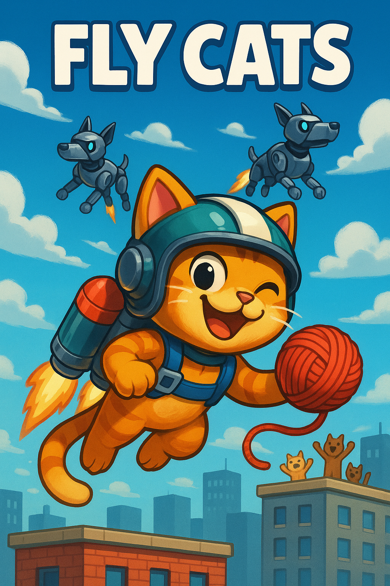

# 🐱 FLY CATS - TP Programación 1 UTNFRA



## 🎮 Descripción

**Fly Cats** es un emocionante juego de acción donde controlas un **gato heroico con jetpack** que debe defender los cielos de la ciudad de una feroz **invasión de perros robot**. Utiliza tu arsenal de **bolas de lana** para eliminar a los invasores y ¡salva el día!

## 🌟 La Triada Salvaje - Nuestro Equipo

### 🦁 Leonardo (León) - Arquitecto & Game Manager
- **Espíritu Animal:** León - El rey que coordina la manada
- **Poderes:** Rugido organizador, visión estratégica de la selva del código
- **Responsabilidades:** 
  - Arquitectura del sistema de estados
  - Integración de módulos y componentes
  - Sistema de puntuaciones y persistencia de datos
  - Gestión de música y audio
  - Coordinación técnica del equipo
- **Email:** [leonardotolaba.20@gmail.com](mailto:leonardotolaba.20@gmail.com)
- **LinkedIn:** [linkedin.com/in/leonardo-manuel-tolaba](https://www.linkedin.com/in/leonardo-manuel-tolaba/)
- **GitHub:** [@Leonardo-MT93](https://github.com/Leonardo-MT93)

### 🦋 Agostina (Mariposa) - Player & Interaction Systems
- **Espíritu Animal:** Mariposa - Transformación elegante y vuelo grácil
- **Poderes:** Metamorfosis de código, movimientos fluidos como el viento
- **Responsabilidades:** 
  - Sistema de movimiento del jugador
  - Mecánicas de control y input
  - Sistema de disparos y proyectiles
  - Interfaz de usuario y feedback visual
  - Experiencia de usuario optimizada
- **Email:** [ramosagostina299@gmail.com](mailto:ramosagostina299@gmail.com)
- **LinkedIn:** [linkedin.com/in/agostina-ramos-7a38b8373](https://www.linkedin.com/in/agostina-ramos-7a38b8373/)
- **GitHub:** [@agosramos299](https://github.com/agosramos299)

### 🐅 Vish (Tigre Blanco) - Enemies & Game Balance
- **Espíritu Animal:** Tigre Blanco - Cazadora misteriosa y letal
- **Poderes:** Instinto depredador, precisión felina en cada línea de código
- **Responsabilidades:** 
  - Sistema de enemigos y patrones de movimiento
  - Sistema de power-ups y balanceado
  - Escalado de dificultad dinámico
  - Sistema de colisiones avanzado
  - Optimización de rendimiento y reciclaje de objetos
- **Email:** [visnupriya.b@live.com.ar](mailto:visnupriya.b@live.com.ar)
- **LinkedIn:** [linkedin.com/in/visnupriya-blanco/](https://www.linkedin.com/in/visnupriya-blanco/)
- **GitHub:** [@visnupriyab](https://github.com/visnupriyab)

### 🐾 Filosofía de La Triada
*"En la naturaleza salvaje del desarrollo, cada animal aporta su esencia única. El León lidera con sabiduría, la Mariposa transforma con belleza, el Tigre ataca con precisión. Juntos, somos imparables."*

### 🌟 Características Principales
- 🚁 **Gato volador con jetpack** - Movimiento fluido en 2D
- 🧶 **Sistema de disparo dinámico** - Bolas de lana como proyectiles
- 🤖 **Sistema de enemigos dinámico** - Perros robot con diferentes resistencias y velocidades
- ⚡ **Power-ups estratégicos** - Doble disparo y vidas extra
- 🎨 **Gráficos estilo cartoon** vibrante y colorido
- 📊 **Sistema de progresión** - Dificultad creciente y puntuaciones
- 🎵 **Banda sonora inmersiva** - Música específica para cada estado del juego

## 🎯 Mecánicas de Juego

### 🕹️ Controles
- **Flechas ←→** - Mover el gato horizontalmente
- **ESPACIO** - Disparar bolas de lana
- **ESC** - Pausa/Acceso al menú
- **UP/DOWN** - Navegación en menús
- **ENTER** - Seleccionar opciones
- **Mouse** - Navegación alternativa en menús

### 🎮 Sistemas de Juego

#### 🛡️ Sistema de Vidas
- Comenzás con **7 vidas**
- Perdés una vida al colisionar con enemigos
- **Invencibilidad temporal** después de recibir daño (parpadeo visual)

#### 🎯 Sistema de Puntuación
- **+100 puntos** por eliminar enemigo básico
- **+200 puntos** por eliminar enemigo resistente
- **+500 puntos** por recolectar atún (power-up)
- **-150 puntos** si un enemigo básico llega al suelo
- **-1000 puntos** si un enemigo resistente llega al suelo
- **Sistema anti-negativo** - El puntaje nunca baja de 0

#### ⚡ Power-ups Disponibles
- **🐟 Atún:** Activa doble disparo por 10 segundos
- **🥛 Milk:** Otorga una vida extra

#### 🤖 Tipos de Enemigos
- **Perros Robot Básicos:** 1 disparo para eliminar, aparecen desde el inicio
- **Perros Robot Resistentes:** 2 disparos para eliminar, aparecen después del minuto 1
- **Sistema de reciclaje infinito** - Los enemigos nunca se agotan

#### 📈 Escalado de Dificultad
- **Primer minuto:** Solo enemigos básicos
- **Después del minuto 1:** Aparición de enemigos resistentes
- **Incremento progresivo** de enemigos resistentes cada 30 segundos
- **Velocidades variables** de caída de enemigos

## 📋 Requisitos Técnicos

- **Python 3.8+**
- **Pygame 2.0+**
- **Sistema operativo:** Windows/Mac/Linux
- **Memoria:** Mínimo 512MB RAM
- **Espacio:** 50MB de almacenamiento

## 🔧 Instalación y Ejecución

```bash
# Clonar el repositorio
git clone https://github.com/Leonardo-MT93/Fly-Cats.git fly-cats-game
cd fly-cats-game

# Instalar dependencias
pip install pygame

# Ejecutar el juego
python main.py
```

## 📁 Arquitectura del Proyecto

```
fly-cats-game/
├── assets/                         # 🎨 Recursos multimedia
│   ├── images/                     # Gráficos del juego
│   │   ├── Balas/                  # Sprites de proyectiles
│   │   ├── enemies/                # Sprites de enemigos
│   │   ├── fondos/                 # Fondos e interfaces
│   │   ├── player/                 # Sprites del jugador
│   │   ├── powerups/               # Íconos de power-ups
│   │   └── intro/                  # Imágenes narrativas
│   ├── sounds/                     # 🎵 Audio del juego
│   │   ├── music/                  # Música de fondo
│   │   │   ├── game_music.ogg      # Música de gameplay
│   │   │   ├── game_over_music.ogg # Música de game over
│   │   │   ├── intro_music.ogg     # Música de introducción
│   │   │   └── menu_music.ogg      # Música del menú
│   │   └── sfx/                    # Efectos de sonido
│   │       ├── disparo_gato.ogg    # Sonido de disparo
│   │       └── maullido_gato.ogg   # Sonido de daño
│   └── puntuaciones.csv            # 📊 Base de datos de puntuaciones
├── game/                           # 🎮 Módulos del núcleo
│   ├── __init__.py                 # Inicializador del paquete
│   ├── bullet.py                   # 🧶 Sistema de proyectiles (Agostina)
│   ├── enemies.py                  # 🤖 Lógica de enemigos (Vish)
│   ├── game_manager.py             # 🎯 Controlador principal (Equipo completo)
│   ├── player.py                   # 🐱 Lógica del jugador (Agostina)
│   └── powerups.py                 # ⚡ Sistema de power-ups (Vish)
├── config.py                       # ⚙️ Configuraciones globales (Leonardo)
├── main.py                         # 🚀 Punto de entrada (Leonardo)
├── utils.py                        # 🛠️ Funciones utilitarias (Leonardo)
├── .gitignore                      # Git ignore rules
├── INSTRUCCIONES_EQUIPO.md         # 📋 Guía para desarrolladores
└── README.md                       # 📖 Este archivo
```

## 🎨 Assets y Recursos

### 🖼️ Recursos Gráficos
- **Sprites del gato** con jetpack en múltiples poses
- **Animaciones de enemigos** robot con efectos visuales
- **Fondos temáticos** para cada estado del juego
- **Íconos de interfaz** optimizados para UI
- **Efectos de partículas** y feedback visual

### 🎵 Recursos de Audio
- **Banda sonora original** compuesta específicamente para cada sección
- **Efectos de sonido** inmersivos y temáticos
- **Audio comprimido** en formato OGG para mejor rendimiento

## 🏆 Objetivos Académicos

### 🎓 Conceptos de Programación 1 Aplicados
- ✅ **Estructuras de control** (if, while, for)
- ✅ **Funciones y modularización**
- ✅ **Listas y diccionarios** para gestión de entidades
- ✅ **Archivos y persistencia** (CSV)
- ✅ **Bibliotecas externas** (Pygame)
- ✅ **Trabajo colaborativo** con Git/GitHub

### 🚫 Restricciones Académicas Respetadas
- ❌ **Try-Except** - No utilizado
- ❌ **Clases de Python** - No implementadas
- ❌ **Funciones Lambda** - No empleadas
- ❌ **Conceptos avanzados** no vistos en la cursada

## 📊 Características Técnicas Avanzadas

### 🎮 Sistema de Estados
- **Máquina de estados robusta** con transiciones fluidas
- **Gestión de memoria optimizada** con reciclaje de objetos
- **Renderizado eficiente** a 60 FPS constantes

### 🔄 Algoritmos de Juego
- **Sistema de colisiones** con detección precisa
- **Algoritmo de aparición** de enemigos con reciclaje infinito
- **Balanceado matemático** de dificultad progresiva

### 📈 Métricas del Proyecto
- **+2000 líneas de código** bien documentadas
- **8 módulos especializados** con responsabilidades definidas
- **5 estados de juego** completamente funcionales
- **20+ funciones** modularizadas y reutilizables

## 🏁 Estado del Desarrollo

### ✅ Características Completadas

#### 🏗️ Arquitectura y Base
- [x] **Configuración inicial del proyecto**
- [x] **Formación de La Triada Salvaje**
- [x] **Asignación de roles**
- [x] **Estructura modular del código**
- [x] **Sistema de estados (State Machine)**
- [x] **Configuraciones centralizadas**

#### 🎮 Sistemas de Gameplay
- [x] **Sistema completo del jugador** (movimiento, controles)
- [x] **Sistema de disparos con bolas de lana**
- [x] **Sistema de enemigos con múltiples tipos**
- [x] **Detección de colisiones avanzada**
- [x] **Sistema de power-ups** (atún, milk)
- [x] **Sistema de vidas con invencibilidad temporal**
- [x] **Reciclaje infinito de enemigos**

#### 🎯 Mecánicas de Puntuación
- [x] **Sistema de puntuaciones completo**
- [x] **Persistencia de datos en CSV**
- [x] **Detección de nuevos récords**
- [x] **Penalizaciones por enemigos en el piso**
- [x] **Rankings de mejores 5 puntuaciones**

#### 🖥️ Interfaz y Navegación
- [x] **Menú principal interactivo**
- [x] **Pantalla de introducción narrativa**
- [x] **Pantalla de Game Over**
- [x] **Pantalla de Nuevo Récord**
- [x] **Sistema de créditos del equipo**
- [x] **Navegación con teclado y mouse**
- [x] **UI optimizada con iconos personalizados**

#### 🎵 Audio y Multimedia
- [x] **Sistema de música por estado**
- [x] **Efectos de sonido inmersivos**
- [x] **Control inteligente de reproducción**
- [x] **Música de introducción temática**
- [x] **Sonidos de disparo y colisión**
- [x] **Audio comprimido optimizado en formato .ogg**

#### ⚡ Optimización y Rendimiento
- [x] **Gestión eficiente de recursos**
- [x] **60 FPS estables sin ralentizaciones**
- [x] **Reciclaje de objetos en memoria**

#### 📊 Balanceado y Jugabilidad
- [x] **Balanceado de velocidades de enemigos**
- [x] **Temporización de power-ups**
- [x] **Progresión de dificultad**
- [x] **Equilibrio entre desafío y diversión**
- [x] **Sistema de doble disparo temporal**

#### 🎨 Arte y Presentación
- [x] **Sprites del gato con jetpack**
- [x] **Animaciones de enemigos robot**
- [x] **Fondos temáticos para cada pantalla**
- [x] **Iconos de UI personalizados**
- [x] **Efectos visuales de parpadeo**

#### 📝 Documentación y Colaboración
- [x] **README completo y actualizado**
- [x] **Instrucciones de instalación**
- [x] **Guías para el equipo**
- [x] **Control de versiones con Git**
- [x] **Commits organizados por desarrollador**

### 🎯 Próximas Mejoras
- [ ] **Easter eggs** de La Triada Salvaje
- [ ] **Nuevos tipos de power-ups**
- [ ] **Más variedad de enemigos**
- [ ] **Múltiples mapas**

## 🤝 Cómo Contribuir

### 🔧 Para Desarrolladores
1. **Fork** el repositorio
2. **Crear rama** para tu feature (`git checkout -b feature/nueva-caracteristica`)
3. **Commit** con emoji del equipo (`git commit -m 'Core: Add nueva caracteristica'`)
4. **Push** a la rama (`git push origin feature/nueva-caracteristica`)
5. **Crear Pull Request** con descripción detallada

### 🎨 Convenciones del Equipo
- **🦁 Core:** Arquitectura y sistemas principales
- **🦋 UI/UX:** Interfaz y experiencia de usuario  
- **🐅 Enemies/Systems:** Gestión de enemigos y sistemas de juego

## 📞 Información de Contacto

### 🏫 Datos Académicos
- **Equipo:** La Triada Salvaje 🦁🦋🐅
- **Universidad:** Universidad Tecnológica Nacional (UTN-FRA)
- **Materia:** Programación 1
- **Año Académico:** 2025
- **Profesor:** Enzo Zotti / Lucas Ferrini
- **Comisión:** DIV 316

## 📄 Licencia y Uso Académico

Este proyecto es desarrollado exclusivamente con **fines académicos** para la materia Programación 1 de la UTN-FRA. 

**Derechos de uso:**
- ✅ **Uso educativo** y referencia académica
- ✅ **Estudio** del código y arquitectura
- ❌ **Uso comercial** no autorizado

## 🎖️ Reconocimientos

### 🏆 Logros del Equipo
- **Trabajo colaborativo ejemplar** con Git/GitHub
- **Arquitectura modular** y escalable
- **Código limpio** y bien documentado
- **Cumplimiento total** de restricciones académicas
- **Innovación** en mecánicas de juego

### 💝 Agradecimientos
- **Universidad Tecnológica Nacional** por la formación
- **Profesores de Programación 1:** Enzo Zotti y Lucas Ferrini por la guía y conocimientos
- **Comunidad de Pygame** por la documentación y recursos

---

## 🌟 Mensaje Final de La Triada Salvaje

*"En la naturaleza salvaje del desarrollo, cada animal aporta su esencia única. El León lidera con sabiduría arquitectónica, la Mariposa transforma la experiencia con belleza funcional, el Tigre ataca los desafíos con precisión algoritmica. Juntos, hemos creado más que un juego: hemos forjado una experiencia que demuestra que la programación es un arte colaborativo donde cada línea de código cuenta una historia."*

**🎮 ¡Que comience la aventura gatuna y que la defensa de la ciudad sea épica!** 

*Desarrollado con 💚 por La Triada Salvaje 🦁🦋🐅*

---

**🚀 Versión:** 1.0 | **📅 Última actualización:** Julio 2025 | **🎯 Estado:** Producción