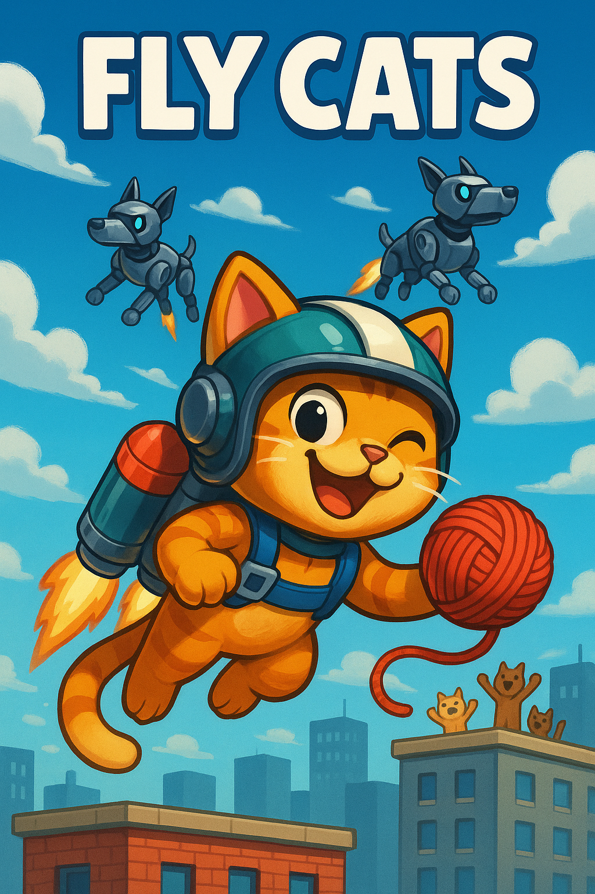

# TP Programación 1 - UTNFRA: 🐱 FLY CATS



## 🎮 Descripción

**Fly Cats** es un juego de acción donde controlas un gato heroico con jetpack que debe defender los cielos de la ciudad de una invasión de perros robot. ¡Dispara bolas de lana y salva el día!

## 🌟 La Triada Salvaje - Nuestro Equipo

### 🦁 León - Game Manager & Integración
- **Espíritu Animal:** León - El rey que coordina la manada
- **Poderes:** Rugido organizador, visión estratégica de la selva del código
- **Responsabilidades:** Arquitectura del juego, integración de módulos, liderazgo técnico
- **Email:** [leonardotolaba.20@gmail.com](mailto:leonardotolaba.20@gmail.com)
- **LinkedIn:** [linkedin.com/in/leonardo-manuel-tolaba](https://www.linkedin.com/in/leonardo-manuel-tolaba/)
- **GitHub:** [@Leonardo-MT93](https://github.com/Leonardo-MT93)

### 🦋 Agostina - Player & Bullets System  
- **Espíritu Animal:** Mariposa - Transformación elegante y vuelo grácil
- **Poderes:** Metamorfosis de código, movimientos fluidos como el viento
- **Responsabilidades:** Sistema de movimiento del jugador, controles, sistema de disparos
- **Email:** Falta completar.
- **LinkedIn:** Falta completar.
- **GitHub:** Falta completar.

### 🐅 Vish - Enemies & PowerUps System
- **Espíritu Animal:** Tigre Blanco - Cazadora misteriosa y letal
- **Poderes:** Instinto depredador, precisión felina en cada línea de código
- **Responsabilidades:** IA de enemigos, sistema de power-ups, balanceado del juego
- **Email:**  Falta completar.
- **LinkedIn:**  Falta completar.
- **GitHub:** Falta completar.

### 🐾 Filosofía de La Triada
*"En la naturaleza salvaje del desarrollo, cada animal aporta su esencia única. El León lidera con sabiduría, la Mariposa transforma con belleza, el Tigre ataca con precisión. Juntos, somos imparables."*

## 🚀 Características

- Gato volador con jetpack
- Sistema de disparo con bolas de lana
- Enemigos perros robot con IA básica
- Power-ups especiales
- Gráficos estilo cartoon vibrante
- Múltiples niveles de dificultad

## 🎯 Cómo Jugar

- **Flechas ←→** - Mover el gato
- **ESPACIO** - Disparar bolas de lana
- **ESC** - Pausa/Menú

## 📋 Requisitos

- Python 3.8+
- Pygame 2.0+
- Sistema operativo: Windows/Mac/Linux

## 🔧 Instalación

```bash
# Clonar el repositorio
git clone https://github.com/Leonardo-MT93/Tp---Programacion1---UTN.git fly-cats-game
cd fly-cats-game

# Instalar dependencias
pip install pygame

# Ejecutar el juego
python main.py
```

## 📁 Estructura del Proyecto

```
fly-cats-game/
├── assets/                         # Recursos gráficos y sonoros
│   ├── images/                     # Imágenes del juego
│   │   ├── enemies/                # Sprites de enemigos (🐅 Vish)
│   │   └── player/                 # Sprites del jugador (🦋 Agostina)
│   ├── sounds/                     # Audio del juego
│   │   └── music/                  # Música de fondo
│   │       ├── game_over_music.ogg  # Música de Game Over
│   │       ├── menu_music.ogg       # Música del menú principal
│   │       └── [pendiente: sonido de juego]  # Música durante gameplay
│   └── puntuaciones.csv            # Archivo de puntuaciones y récords
├── game/                           # Módulos del juego
│   ├── __init__.py                 # Inicializador del paquete
│   ├── bullet.py                   # Sistema de proyectiles (🦋 Agostina)
│   ├── enemies.py                  # Lógica de enemigos (🐅 Vish)
│   ├── game_manager.py             # Controlador principal (🦁 León, 🐅 Vish y 🦋 Agostina)
│   ├── player.py                   # Lógica del jugador (🦋 Agostina)
│   └── powerups.py                 # Sistema de power-ups (🐅 Vish)
├── .gitignore                      # Archivos ignorados por Git
├── config.py                       # Configuraciones del juego (🦁 León)
├── INSTRUCCIONES_EQUIPO.md         # Guía de trabajo para La Triada Salvaje
├── main.py                         # Punto de entrada del juego (🦁 León)
├── README.md                       # Este archivo
└── utils.py                        # Funciones utilitarias (🦁 León)
```

## 🎨 Assets y Recursos (por definir)

Los assets del juego incluyen:
- Sprites de gatos con jetpack
- Animaciones de perros robot
- Efectos de partículas
- Fondos de ciudad
- Sonidos y música

## 🏆 Objetivos del Proyecto

Este proyecto es parte del curso de Programación 1 de la UTN, enfocado en:
- Manejo de eventos y colisiones
- Trabajo colaborativo con Git/GitHub
- Desarrollo de videojuegos con Python/Pygame

## 🚫 No visto en la materia

Este proyecto no debe tener los siguientes temas no visto en la cursada:
- Try - Except
- Clases de python
- Funcion Lambda

## 📈 Estado del Desarrollo

- [x] Configuración inicial del proyecto
- [x] Formación de La Triada Salvaje
- [x] Asignación de roles por espíritu animal
- [x] Sistema básico del jugador
- [x] Sistema de enemigos
- [x] Sonidos y música
- [x] Menú principal
- [ ] Detección de colisiones
- [ ] Sistema de power-ups
- [ ] Aumento de dificultad al pasar el tiempo
- [ ] Sistema de puntuaciones
- [ ] Easter eggs de La Triada Salvaje

## 🤝 Contribuir

Este es un proyecto académico de **La Triada Salvaje**. Para contribuir:

1. Fork el repositorio
2. Crear una rama para tu feature (`git checkout -b feature/nueva-caracteristica`)
3. Commit con emoji animal (`git commit -m '🦁 Core: Add nueva caracteristica'`)
4. Push a la rama (`git push origin feature/nueva-caracteristica`)
5. Crear un Pull Request

## 📞 Contacto

### 🏫 Información Académica
- **Equipo:** La Triada Salvaje 🦁🦋🐅
- **Universidad:** Universidad Tecnológica Nacional (UTN)
- **Materia:** Programación 1
- **Año:** 2025

## 📄 Licencia

Este proyecto es parte de un trabajo académico para la UTN, desarrollado por **La Triada Salvaje**.

---

*🌟 "En la naturaleza del código, la triada nunca falla" - La Triada Salvaje 🦁🦋🐅*

*¡Que comience la aventura gatuna! 🚀🐱*